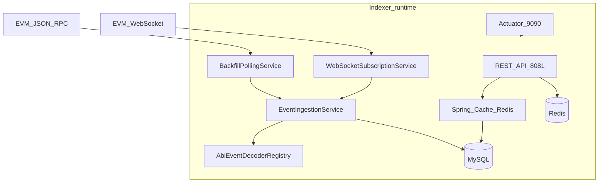

# Architecture

## Logical view

## Data flow

1. **Polling** loads confirmed blocks in chunks (`max-blocks-per-poll`), applies optional multi-contract `eth_getLogs` filters (topic list from decoders), decodes logs, upserts `blockchain_events` and `transaction_details`, advances `listener_state`.
2. **WebSocket** ingests live logs from the same filter set; ingestion deduplicates on `(chain_id, tx_hash, log_index)`.
3. **Queries** hit JPA with Redis-backed caching for paginated event reads.

## Security boundaries

- Application API (`/api/v1`) requires OAuth2 Resource Server **JWT** (HS256).
- Management port exposes health and Prometheus; restrict at network level (ClusterIP, NetworkPolicy, or private scrape).

## Per-chain deployments

Run **one Helm release per chain** with its own `CHAIN_ID`, RPC endpoints, and secrets. Sharing one MySQL schema across chains is possible if you add a `chain_id` dimension to `listener_state` (optional migration); the default schema assumes a single logical chain per database.
